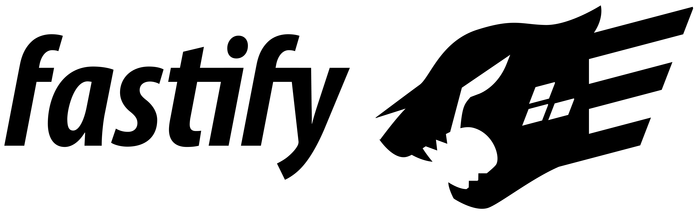
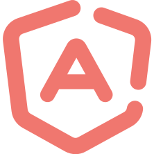

<HeroSection>

# Ajv JSON schema validator

## Security and reliability for JavaScript applications

<Features>
<Feature type="less-code" link="/guide/why-ajv.html#write-less-code">

### Write less code

Ensure your data is valid once it is received

</Feature>
<Feature type="fast-secure" link="/guide/why-ajv.html#super-fast-secure">

### Super fast & secure

Compiles your schemas to optimized JavaScript code

</Feature>

<Feature type="multi-spec" link="/guide/why-ajv.html#multi-standard">

### Multi-standard

Use JSON Type Definition or JSON Schema

</Feature>
</Features>

<Sponsors level="platinum">

## Ajv sponsors

[](https://www.mozilla.org)
[](https://opencollective.com/ajv)

</Sponsors>

<Sponsors level="gold">

[](https://opensource.microsoft.com)
[](https://opencollective.com/ajv)
[](https://opencollective.com/ajv)

</Sponsors>

<Sponsors level="bronze">

[](https://retool.com/?utm_source=sponsor&utm_campaign=ajv)
[](https://tidelift.com/subscription/pkg/npm-ajv?utm_source=npm-ajv&utm_medium=referral&utm_campaign=enterprise)
[](https://github.com/simplex-chat/simplex-chat)
[](https://opencollective.com/ajv)

</Sponsors>

</HeroSection>

<HomeSection>
<Columns>
<Column side="left">

Ajv is used by a large number of JavaScript applications and libraries in all JavaScript environments - Node.js, browser, Electron apps, WeChat mini-apps etc.

It allows implementing complex data validation logic via declarative schemas for your JSON data, without writing code.

Out of the box, Ajv supports [JSON Schema](./json-schema.md) (drafts 04, 06, 07, 2019-09 and 2020-12) and [JSON Type Definition](./json-type-definition.md) ([RFC8927](https://datatracker.ietf.org/doc/rfc8927/)).

<br/>

<Button link="/guide/getting-started.html">Learn Ajv</Button>

<br/>

</Column>

<Column side="right">
<code-group>
<code-block title="JSON Schema">
```javascript
const Ajv = require("ajv")
const ajv = new Ajv()

const schema = {
  type: "object",
  properties: {
    foo: {type: "integer"},
    bar: {type: "string"}
  },
  required: ["foo"],
  additionalProperties: false
}

const data = {foo: 1, bar: "abc"}
const valid = ajv.validate(schema, data)
if (!valid) console.log(ajv.errors)
```
</code-block>

<code-block title="JSON Type Definition">
```javascript
const Ajv = require("ajv/dist/jtd")
const ajv = new Ajv()

const schema = {
  properties: {
    foo: {type: "int32"}
  },
  optionalProperties: {
    bar: {type: "string"}
  }
}


const data = {foo: 1, bar: "abc"}
const valid = ajv.validate(schema, data)
if (!valid) console.log(ajv.errors)
```
</code-block>
</code-group>
</Column>
</Columns>
</HomeSection>

<HomeSection section="testimonials">

## What users say

<Testimonials>
<Testimonial color="green">

Ajv stands out as the implementation of choice - it provides a rich API which many thousands of people use in production... Ajv is partly responsible for the success of JSON Schema.

[Ben Hutton](https://github.com/relequestual), JSON Schema Specification Lead

</Testimonial>

<Testimonial color="blue">

[ESLint](https://eslint.org/) has used Ajv for validating our complex configurations. Ajv has proven to be reliable over the years we’ve been using it and ESLint is proud to sponsor Ajv’s continued development.

[Nicholas C. Zakas](https://github.com/nzakas), ESLint creator and TSC member

</Testimonial>
</Testimonials>

<span style="float:right;">[All quotes](./testimonials.md)</span>

</HomeSection>

<HomeSection>

## News

<NewsHome/>

</HomeSection>

<HomeSection>

## Who uses Ajv

<Projects>
[](https://eslint.org)
[](https://stoplight.io)
[](https://webpack.js.org)
[table](https://github.com/gajus/table)
[](https://www.fastify.io)
[restbase](https://github.com/wikimedia/restbase)
[objection.js](https://github.com/vincit/objection.js)
[](https://taskcluster.net)
[](https://rxdb.info)
[](https://github.com/rjsf-team/react-jsonschema-form)
[](https://github.com/Azure/autorest)
[](https://github.com/node-red/node-red)
[](https://developer.mozilla.org)
[](https://github.com/quicktype/quicktype)
[](https://github.com/vue-generators/vue-form-generator)
[](https://github.com/teambit/bit)
[React Page](https://react-page.github.io)
[](https://backstage.io)
[](https://github.com/microsoft/rushstack)
[JupyterLab](https://github.com/jupyterlab/jupyterlab)
[](https://github.com/davidmarkclements/0x)
[Plank.js](https://piqnt.com/planck.js/)
[](https://www.fast.design)
[](https://www.netlifycms.org)
[](https://ng-alain.com/en)
[](https://vercel.com)
[](https://github.com/aws-amplify/amplify-cli)
[](https://github.com/facebook/flipper)
[](https://nx.dev)
[](https://www.express-gateway.io)
[](https://www.zigbee2mqtt.io)
[](https://github.com/sverweij/dependency-cruiser)
[](https://theia-ide.org)
[](https://tsdoc.org)
[](https://webhint.io)
[Vega-Lite](https://vega.github.io/vega-lite/)
[](https://middy.js.org)
[JSDoc](https://github.com/jsdoc/jsdoc)
[](https://tsed.io)

</Projects>
</HomeSection>

<HomeSection section="contributors">

## Contributors

Ajv is free to use and open-source that many developers contributed to. Join us!

<Contributors />

</HomeSection>

<HomeSection section="footer">

<FooterColumns>
<FooterColumn type="ajv">


</FooterColumn>

<FooterColumn type="links">

[Learn Ajv](./guide/getting-started.md)

[Reference](./api.md)

[Security](./security.md)

</FooterColumn>

<FooterColumn type="links">

[JSON Schema](./json-schema.md)

[JSON Type Definition](./json-type-definition.md)

[Contributing](./contributing.md)

</FooterColumn>

<FooterColumn type="sponsors">

[](https://www.mozilla.org)
[](https://opencollective.com/ajv)

</FooterColumn>
</FooterColumns>

[&copy; 2015-2021](./license.md) | Ajv JSON schema validator | [ajv.validator@gmail.com](mailto:ajv.validator@gmail.com)

</HomeSection>
